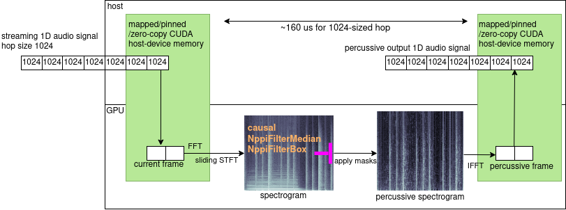
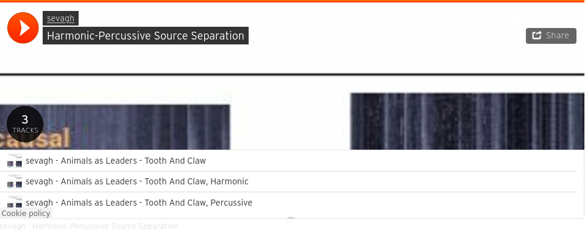
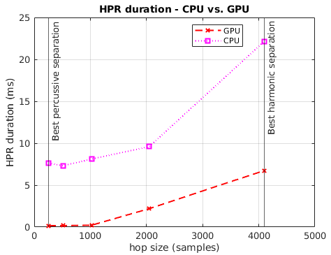
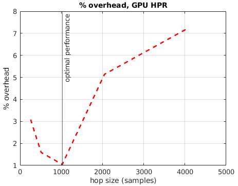
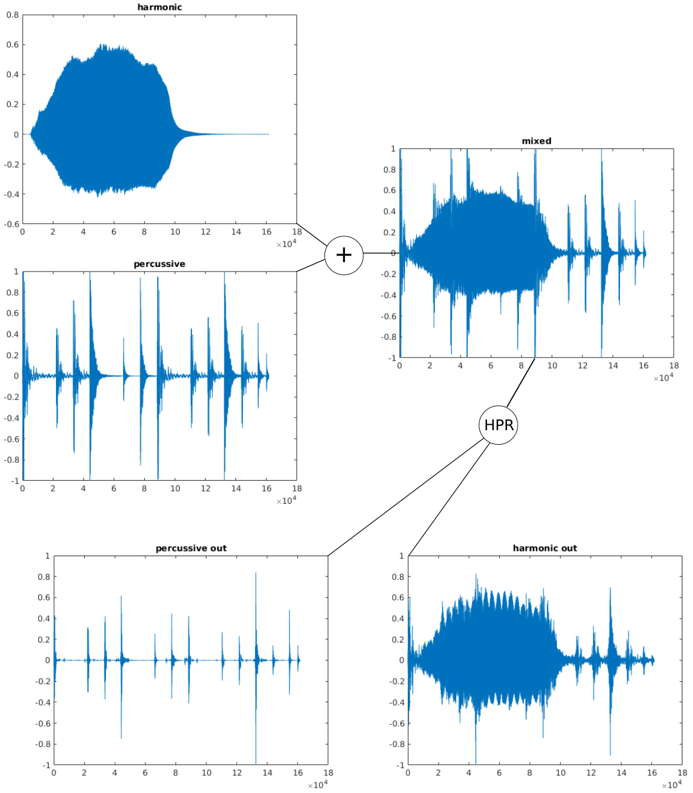
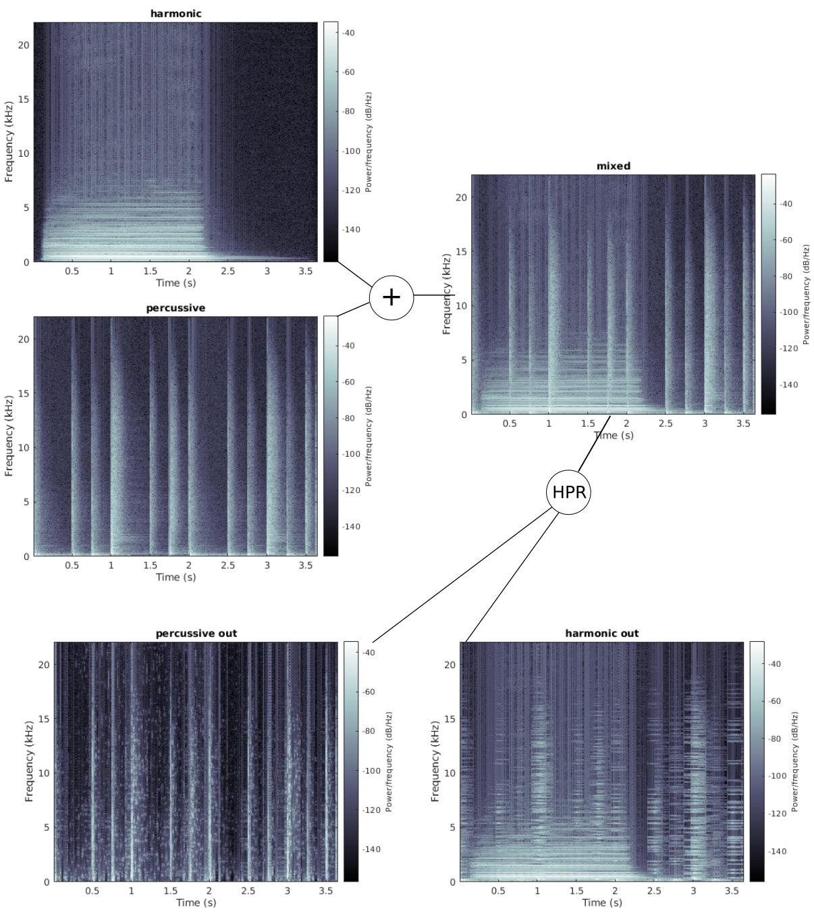
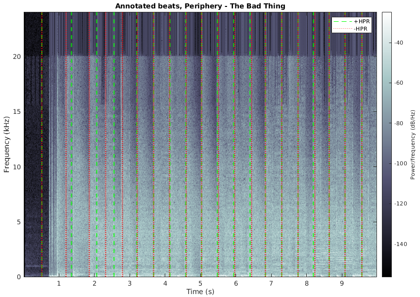

# Zen

Zen is a real-time capable, CUDA-accelerated harmonic/percussive source separation library, which implements:
* Harmonic-percussive source separation using median filtering ([Fitzgerald 2010](http://dafx10.iem.at/papers/DerryFitzGerald_DAFx10_P15.pdf), [Drieger et al 2014](https://archives.ismir.net/ismir2014/paper/000127.pdf))
* Steady-state/transient source separation using SSE (stochastic spectrum estimation) filtering ([Bayarres 2014](https://iie.fing.edu.uy/publicaciones/2014/Iri14/Iri14.pdf))

Note that the Npp/Ipp FilterBox (moving average filter) functions in the SSE filtering case are not as well-behaved as the FilterMedian functions - use caution with the SSE implementation.

Zen was written from the ground up to support dual CPU/GPU implementations of algorithms by using policy-based template metaprogramming. For specialized subroutines (e.g. cuFFT, Npp/Ipp), there are abstraction wrappers.

| Component | License | Description | Dependencies |
|-----------|---------|-------------|--------------|
| [libzen](./libzen/) | MIT | Core C++ library | IPP, CUDA Toolkit [+ gtest, benchmark for tests] |
| [zen](./zen/) | MIT | Reference command-line tool | IPP, CUDA Toolkit, [libnyquist](https://github.com/ddiakopoulos/libnyquist), [clipp](https://github.com/muellan/clipp) |
| [pitch-tracking](./pitch-tracking) | MIT | Demo of real-time pitch tracking ([McLeod Pitch Method](http://www.cs.otago.ac.nz/tartini/papers/A_Smarter_Way_to_Find_Pitch.pdf)) with **harmonic separation pre-processing**. Includes an optimized implementation of MPM using IPP FFT | IPP, CUDA Toolkit, [libnyquist](https://github.com/ddiakopoulos/libnyquist) |
| [beat-tracking](./beat-tracking) | GPLv3 | Demo of real-time beat tracking ([BTrack](https://github.com/adamstark/BTrack)) with **percussive separation pre-processing**. Includes an optimized implementation of BTrack using IPP FFT. | IPP, CUDA Toolkit, [libnyquist](https://github.com/ddiakopoulos/libnyquist), [gcem](https://github.com/kthohr/gcem) |

**NB** The algorithms are intended to be used with a causal real-time input stream. For simplicity, all real-time demo code uses offline wav files, but steps through them in hops to simulate real-time.

## Block diagram



## Example

Click this to see an example on my Soundcloud page:

[](https://soundcloud.com/user-167126026/sets/harmonic-percussive-source-separation)

## Results

1024-hop GPU HPR is the sweet spot of performance:

 

### Waveforms



### Spectrograms



### Performance

### Pre-processing for pitch tracking

The [pitch-tracking](./pitch-tracking) demo applies real-time harmonic separation with a hop size of 4096 (optimal for harmonic results), and applies the McLeod Pitch Method on a stream of 4096-sized chunks from a wav file.

The clip [samples/simple_mixed.wav](./samples/simple_mixed.wav) contains a viola playing an E3 with a superimposed drum track. The demo results show that the pitch tracking is improved with real-time harmonic separation. **Verdict:** :heavy_check_mark:
```
$ ./build/pitch-tracking/pitch-track ./samples/simple_mixed.wav
t: 1.11,        pitch (+HPR): 163.11,   pitch (-HPR): 741.54
t: 1.21,        pitch (+HPR): 163.18,   pitch (-HPR): 2164.02
t: 1.30,        pitch (+HPR): 163.26,   pitch (-HPR): 177.98
t: 1.39,        pitch (+HPR): 163.29,   pitch (-HPR): 217.32
t: 1.49,        pitch (+HPR): 163.30,   pitch (-HPR): -1.00
t: 1.58,        pitch (+HPR): 163.36,   pitch (-HPR): 394.03
t: 1.67,        pitch (+HPR): 163.34,   pitch (-HPR): -1.00
t: 1.76,        pitch (+HPR): 163.28,   pitch (-HPR): 152.21
t: 1.86,        pitch (+HPR): 163.52,   pitch (-HPR): 183.38
t: 1.95,        pitch (+HPR): 163.49,   pitch (-HPR): -1.00
t: 2.04,        pitch (+HPR): 163.86,   pitch (-HPR): -1.00
t: 2.14,        pitch (+HPR): 163.57,   pitch (-HPR): -1.00
t: 2.23,        pitch (+HPR): 163.46,   pitch (-HPR): 854.43
t: 2.32,        pitch (+HPR): 163.46,   pitch (-HPR): -1.00
t: 2.41,        pitch (+HPR): 163.08,   pitch (-HPR): -1.00
```

### Pre-processing for beat tracking

The [beat-tracking](./beat-tracking) demo applies real-time percussive separation with a hop size of 256 (optimal for percussive results), and applies BTrack on a stream of 256-sized chunks from a wav file.

The clip is the first 10 seconds of Periphery - The Bad Thing. **Verdict:** :x:


## Origin

This is a followup to my project [Real-time Harmonic-Percussive Source Separation](https://github.com/sevagh/Real-Time-HPSS). In the previous project, I showed that Fitzgerald's 2010 algorithm for median-filtering harmonic-percussive source separation (and Drieger et al's subequent 2014 modification) could be adapted to work in real-time. However, my simple MATLAB and Python implementations were too slow to be feasible (~5-10ms of processing per 10ms hop in a real-time stream).

Using CUDA and NPP to implement median-filtering-based HPR (harmonic-percussive-residual) separation, I got the computation time down to ~160us for a 10ms input buffer in this library, making it viable as an early stage in a real-time processing chain.

### Usage

#### Build

Zen uses CMake (and is not simple to build). You need to adjust [CMakeLists.txt](./CMakeLists.txt) to specify locations for your custom GCC (for nvcc), CUDA toolkit libraries, and IPP libraries. I suggest using Ninja:

```
$ mkdir -p build && cd build && cmake .. -GNinja && ninja -j16
```

#### libzen library examples

The [pitch-tracking main.cu](./pitch-tracking/main.cu) and [beat-tracking main.cu](./beat-tracking/main.cu) files show example usages of `HPRRealtime<Backend::GPU>` for creating real-time pure harmonic and pure percussive separations.

#### zen command-line tool usage

The [zen](./zen) command line tool implements all of the classes and algorithms of Zen:
```
usage:

  zen offline -i, --input <infile> [--hps [<hop-h>] [<beta-h>] [<hop-p>] [<beta-p>]] [-o,
      --out-prefix <outfile_prefix>] [--cpu] [--sse] [--soft-mask] [--nocopybord]

  zen fakert -i, --input <infile> [--hps [<hop>] [<beta>]] [-o, --output <outfile>] [--cpu] [--sse]
      [--soft-mask] [--nocopybord]

  zen help | -h | --help
  zen version | -v | --version
```

By default, `beta` is the separation factor of Drieger et al's Harmonic-Percussive-Residual technique. If using `--soft-mask`, `beta` is the raised power of the Wiener soft mask. If using `--sse`, the parameter `beta` is ignored.

Example of the iterative offline separation into 3 components, harmonic/percussive/residual:
```
$ ./zen offline --hps 4096 2.5 256 2.5 --input ../samples/mixed.wav --out-prefix offline-sep
Running zen-offline with the following params:
        infile: ../samples/mixed.wav
        outfile_prefix: offline-sep
        do hps: yes
                harmonic hop: 4096
                harmonic beta: 2.5
                percussive hop: 256
                percussive beta: 2.5
                mask: hard/binary
                filter: median
        compute: gpu (cuda/npp)
Audio file info:
        sample rate: 44100
        len samples: 161571
        frame size: 2
        seconds: 3.66374
        channels: 1
Processing input signal of size 161571 with HPR-I separation using harmonic params: 4096,2.5, percussive params: 256,2.5
GPU/CUDA/thrust: 2-pass HPR-I-Offline took 487 ms
$
$ ls offline-sep*
offline-sep_harm.wav  offline-sep_perc.wav  offline-sep_residual.wav
```

Example of fakert (aka "fake-real-time" using streaming wav files) separation into a single percussive component:
```
$ ./zen fakert --input ../samples/mixed.wav -o perc.wav --hps 256 2.5
Running zen-fakert with the following params:
        infile: ../samples/mixed.wav
        outfile: perc.wav
        do hps: yes
                hop: 256
                beta: 2.5
                mask: hard/binary
                filter: median
        compute: gpu (cuda/npp)
Audio file info:
        sample rate: 44100
        len samples: 161571
        frame size: 2
        seconds: 3.66374
        channels: 1
Slicing buffer size 161571 into 631 chunks of size 256
PRealtime GPU:  Δn = 256, Δt(ms) = 5.80499, average processing duration(us) = 173.99
$
$ ls perc.wav
perc.wav
```

## Development

I currently build and compile Zen on Linux (Fedora 32) using GCC 8, CUDA Toolkit 10.2, and nvcc on an amd64 Ryzen host with an NVIDIA RTX 2070 SUPER. All NVIDIA libraries were installed and managed using negativo17's Fedora nvidia repository.

There are unit tests in the libzen source tree. Memory and UB checks can be run during the test suite as follows. I favor asan over valgrind, but we need some special ASAN options to not clash with CUDA. I also try to use cuda-memcheck, but it slows execution down too much in some cases.

```
$ mkdir -p build && cd build && cmake .. -GNinja -DENABLE_UBSAN=ON -DENABLE_ASAN=ON
$ ninja -j16
$ export ASAN_OPTIONS="protect_shadow_gap=0:replace_intrin=0:detect_leaks=0"
$ ninja test
```
